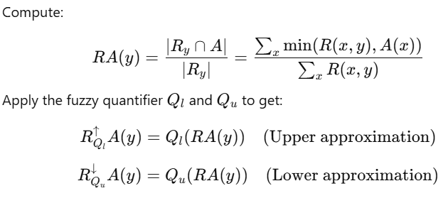
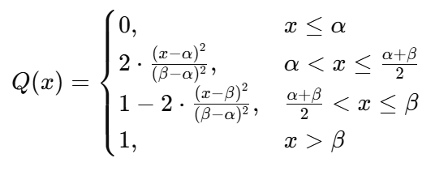

# VQRS model

## 1. Introduction

VQRS stands for **Vaguely Quantified Rough Sets**. In FRsutils, VQRS uses fuzzy
quantifiers to compute lower and upper approximation degrees from a fuzzy
similarity relation and class labels.

## 2. Intuition

For each instance, VQRS compares the instance to all other instances through the
active similarity relation. The model then measures how strongly the similar
instances support membership in the target class. Fuzzy quantifiers control how
strict the lower and upper approximation interpretations are.

## 3. Definitions

Let:

- `U` be the universe of instances.
- `R(x, y)` be the fuzzy similarity between instances `x` and `y`.
- `X` be a target class or decision concept.
- `Q_l` be the lower-approximation fuzzy quantifier.
- `Q_u` be the upper-approximation fuzzy quantifier.

For each instance `x`, VQRS aggregates similarity mass from class-compatible and
all comparable instances, then applies the selected fuzzy quantifier.

## 4. Lower and upper approximations in VQRS

The lower approximation captures conservative support for class membership. The
upper approximation captures possible support for class membership. FRsutils
implements these calculations through the public approximation API and supports
dense and exact blockwise execution paths.

### Lower and upper approximation reference

### Quadratic fuzzy quantifier reference

## 5. Current execution status

VQRS supports:

- dense NumPy execution,
- exact blockwise NumPy execution,
- optional CuPy similarity-block execution,
- experimental GPU-resident blockwise accumulator execution for the VQRS
  approximation path, with final public output converted back to NumPy arrays.
